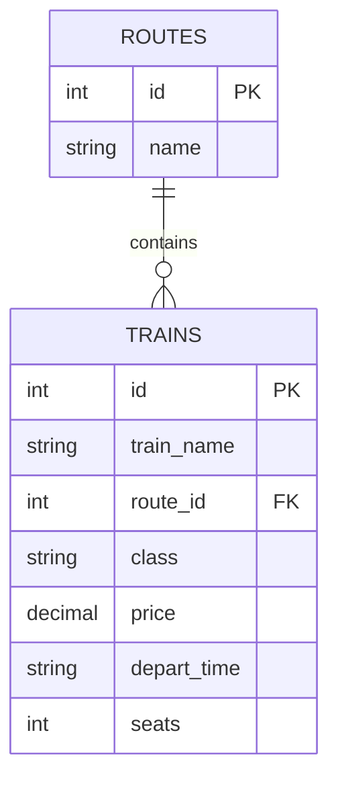

# 🚆 Railway Management System


A comprehensive, web-based **Railway Management System** built with **PHP** and **MySQL**. This application streamlines the process of booking train tickets, managing train schedules, and categorizing travel classes. It features a responsive modern UI, dynamic data fetching, and an integrated booking workflow.

---

## 📖 Table of Contents
- [Features](#-features)
- [Technology Stack](#-technology-stack)
- [Screenshots](#-screenshots)
- [Installation & Setup](#-installation--setup)
- [Database Schema](#-database-schema)
- [Project Structure](#-project-structure)
- [Future Roadmap](#-future-roadmap)
- [Contributing](#-contributing)

---

## ✨ Features

### 👤 User Interface (Frontend)
- **Hero Section:** Video background with a dynamic "Quick Search" widget for finding trains between cities.
- **Responsive Design:** Built with **Bootstrap 5.3**, ensuring full compatibility across mobile, tablet, and desktop.
- **Animations:** Smooth scroll animations using **AOS (Animate On Scroll)**.
- **Dynamic Train Listing:** Trains are automatically fetched from the database and grouped by class:
  - Business
  - Economy
  - AC Standard
  - AC Sleeper

### ⚙️ Functionality (Backend)
- **Session Management:** Secure login/logout logic with cache control to prevent back-button re-entry after logout.
- **Role-Based Access:** Differentiates between normal Users and Admins (displays "👑 Admin Panel" link for admins).
- **Booking System:**
  - Interactive Modal for ticket reservation.
  - Auto-fills train details (Name, Route, Price) when "Book Now" is clicked.
  - Form validation (Client-side JS).
  - **Payment Integration UI:** Toggles between Stripe (Card) and JazzCash (Mobile) input fields.

---

## 🛠 Technology Stack

| Component | Technology |
|-----------|------------|
| **Backend** | Core PHP (PDO), MySQL |
| **Frontend** | HTML5, CSS3, JavaScript (ES6) |
| **Framework** | Bootstrap 5.3.3 |
| **Libraries** | AOS (Animations) |
| **Server** | Apache (XAMPP/WAMP) |

---

## 📸 Screenshots

---

## 🚀 Installation & Setup

### Prerequisites
* **XAMPP / WAMP / MAMP** (or any PHP server environment).
* **MySQL** Database.

### Steps
1.  **Clone the Repository**
    ```bash
    git clone [https://github.com/your-username/railway-management-system.git](https://github.com/your-username/railway-management-system.git)
    cd railway-management-system
    ```

2.  **Database Configuration**
    * Create a database named `railway_db`.
    * Import the SQL schema provided below.
    * Update `connect.php` with your credentials:
        ```php
        $host = 'localhost';
        $db   = 'railway_db';
        $user = 'root';
        $pass = '';
        ```

3.  **Run the Project**
    * Place the project folder in your server's root directory (e.g., `htdocs`).
    * Open your browser and navigate to:
        `http://localhost/railway-management-system/index.php`

---

## 🗄 Database Schema

To ensure the application runs smoothly, execute the following SQL.

### 1. Visual Relationship Diagram


### 2. SQL Setup Commands

**Routes Table**

```sql
CREATE TABLE routes (
    id INT AUTO_INCREMENT PRIMARY KEY,
    name VARCHAR(255) NOT NULL -- e.g., "Lahore to Karachi"
);

```

**Trains Table**

```sql
CREATE TABLE trains (
    id INT AUTO_INCREMENT PRIMARY KEY,
    train_name VARCHAR(255) NOT NULL,
    route_id INT,
    class VARCHAR(50) NOT NULL, -- 'Business', 'Economy', etc.
    price DECIMAL(10,2) NOT NULL,
    depart_time VARCHAR(50),
    seats INT,
    image VARCHAR(255),
    created_at TIMESTAMP DEFAULT CURRENT_TIMESTAMP,
    FOREIGN KEY (route_id) REFERENCES routes(id)
);

```

> **💡 Pro Tip:** To create an **Admin User**, insert a user into your `users` table and set the role to 'admin'.
> ```sql
> INSERT INTO users (username, email, password, role) VALUES ('Admin', 'admin@railway.com', 'admin123', 'admin');
> 
> ```
> 
> 

---

## 📂 Project Structure

Here is a breakdown of the key files and folders:

```text
railway-system/
├── 📂 admin-panel/        # 🔐 The Engine Room
│   ├── uploads/           # Stores train images uploaded by admins
│   ├── user_dashboard.php # Customer booking history
│   └── login/register.php # Auth logic
│
├── 📂 pages/              # 📄 Static Content
│   ├── trains.php         # Full schedule list
│   └── contact.php        # Support forms
│
├── 📄 connect.php         # 🔌 Database Connection (Do not share this!)
├── 📄 index.php           # 🏠 Homepage (The file you viewed)
├── 📄 main.css            # 🎨 Styling & Theme
├── 📄 submit_booking.php  # 📨 Process booking logic
└── 📄 README.md           # 📘 You are reading this

```

---

## 🗺 Future Roadmap

We have big plans for this project! Here is what we are working on next:

* [ ] **Seat Selection Map:** Allow users to pick specific seat numbers visually.
* [ ] **Email Notifications:** Send tickets via PHPMailer upon booking confirmation.
* [ ] **Admin Analytics:** A chart dashboard showing daily revenue using Chart.js.
* [ ] **PNR Status Check:** A module to track booking status using a unique ID.

---

## 🤝 Contributing

Contributions make the open-source community an amazing place to learn, inspire, and create. Any contributions you make are **greatly appreciated**.

1. **Fork** the Project
2. Create your Feature Branch (`git checkout -b feature/AmazingFeature`)
3. **Commit** your Changes (`git commit -m 'Add some AmazingFeature'`)
4. **Push** to the Branch (`git push origin feature/AmazingFeature`)
5. Open a **Pull Request**

---

## 📝 License

Distributed under the MIT License. See `LICENSE` for more information.

---

## 👤 Author

**[Muhammad Zeeshan Islam](https://github.com/zeeshan020dev)**  
Co-Founder – Unicodrex | Technical Associate – Skill Sprint

[](https://github.com/zeeshan020dev)


<div align="center">
<p>If you found this project helpful, please give it a ⭐!</p>
<p>Built with ❤️ for Academic Project</p>
</div>
